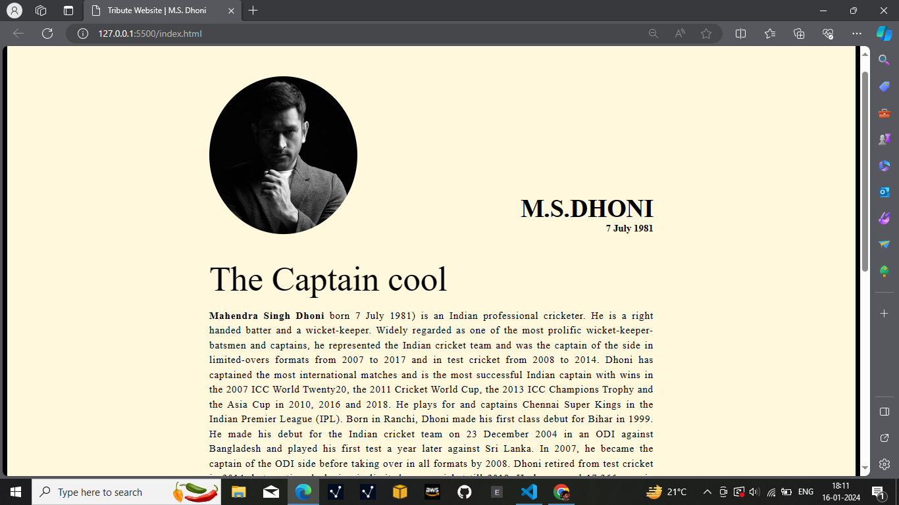

# Tribute Page Project

__Project Overview:__
This project is a tribute page built using HTML and CSS, honoring a notable figure. The page features a visually appealing design with sections dedicated to the person's biography, achievements, and notable contributions.

__Key Features:__

- Responsive Design: The page is designed to be responsive and accessible across various devices.

- Custom CSS Styling: Utilizes custom CSS to create a unique and engaging visual experience.

- Biographical Content: Includes detailed biographical information and achievements of the tribute subject.

__Technologies Used:__

- HTML for structuring content

- CSS for styling and layout

__How to Use:__

- Clone the repository to your local machine.

- Open the index.html file in a web browser to view the tribute page.

__Contributions:__
Feel free to contribute by enhancing the design or adding more features!
